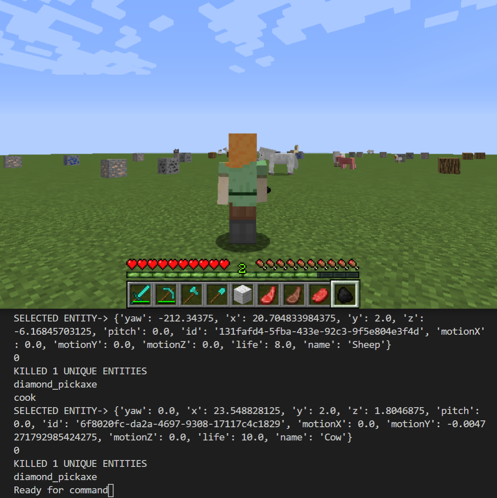
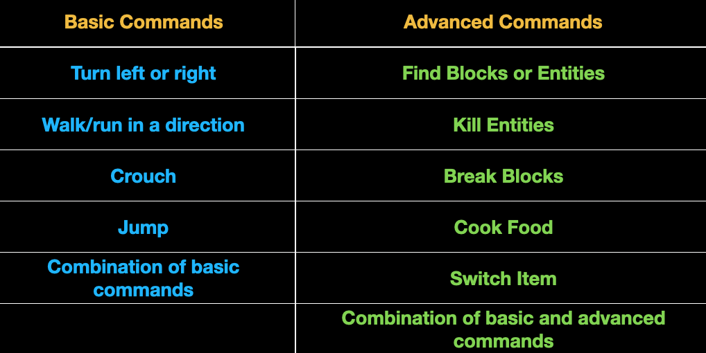

# Speech-To-Steve 

Speech-To-Steve project is aiming to allow users to control the malmo agents via speech. At a high level, this is implemented by taking speech from the user and coverting it into text using Google SpeechRecognition, and using NLP libraries spaCy to parse and process the text to parameters, which will be fed to the commands in malmo. In addition, we implemented similarity check to the objects and multistep commands. This allows our agent, for example, understanding that stallions and horses are the same, or jumping exactly 10 times if such commands are given.

### Voice Commands Supported
In order to decrease the cost, we also implemented similarity check on objects with support of spaCy so that the malmo agent is able to recognize "destroy" as "kill", "stallion" as "horse", etc. 

### Accuracy Evaluation:

  |                 |Speech Recognition Accuracy| Command Parsing Accuracy| Command Executed Accuracy|
  |-----------------|---------------------------|-------------------------|---------------------------|
  |Basic Commands   |         95.20%            |         95.20%          |            95.20%         |
  |Advanced Commands|         86.80%            |         88.00%          |            91.02%         |

### References

#### Python Libraries/Third-Party Source Code Used
- [SpeechRecognition](https://pypi.org/project/SpeechRecognition/)\
Library for performing speech recognition
- [PyAudio](https://pypi.org/project/PyAudio/)\
Record audio input from microphone
- [Google Speech Recognition API](https://cloud.google.com/speech-to-text)\
Convert audio into text
- [spaCy](https://spacy.io/usage/spacy-10z)\
Information extraction and natural language understanding
- [NeuralCoref](https://github.com/huggingface/neuralcoref/pulls)\
Pipeline extension for spaCy 2.1+ which annotates and resolves coreference clusters using a neural network
- [craft_work.py](https://github.com/microsoft/malmo/blob/master/Malmo/samples/Python_examples/craft_work.py)\
Malmo tutorial file used as reference for some crafting-related commands

#### Relevant Information/Images Used
- [Speech Recognition Systems](https://heartbeat.fritz.ai/the-3-deep-learning-frameworks-for-end-to-end-speech-recognition-that-power-your-devices-37b891ddc380)\
Explanation of how basic speech-to-text models work and visualization of these models
- [spaCy Documentation](https://spacy.io/usage)\
Detailed explanation of how spaCy works and its usage, as well as various diagrams
- [NeuralCoreF Documentation](https://medium.com/huggingface/state-of-the-art-neural-coreference-resolution-for-chatbots-3302365dcf30)\
Detailed explanation of how NeuralCoref works and its usage, as well as various diagrams.
