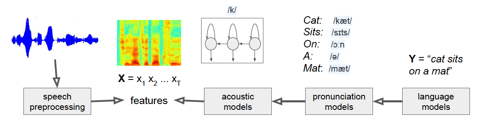

## Video Summary

## Project Summary

The main idea of our project is using Python to implement a way for the user to control the AI agent via speech. At a high level, this is implemented by taking speech from the user and coverting it into text using Google SpeechRecognition, and using NLP libraries spaCy to parse and process the text to parameters, which will be fed to the commands in malmo. In addition, we implemented similarity check to the objects and multistep commands. This allows our agent, for example, understanding that stallions and horses are the same, or jumping exactly 10 times if such commands are given. 

#### Language: Python
#### Library Support: 
- SpeechRecognition
- PyAudio
- NeuralCoref
- spaCy

#### Implemented Commands

## Approaches

In order to implement Speech-To-Steve, we relied heavily on natural language processing to parse spoken commands into a format that the Malmo agent could "understand" and execute. To begin with, we needed to capture audio input from the user and convert it into a string that can be further parsed. We decided to use the PyAudio library to record microphone input and the SpeechRecognition library to convert the audio input into a string. The SpeechRecognition library simply provides a way to connect existing speech recognition APIs to Python seamlessly. For Speech-To-Steve, we decided on using the free Google Speech Recognition API due to its high accuracy from utilizing Google's extensive and powerful machine learning technology. SpeechRecogntion allows us to convert the results of parsing our audio input through the Google Speech Recognition API into a string, which we will further parse.

### Classical Speech Recognition System

Essentially, the Google Speech Recognition API will break down an audio file into small pieces and analyzed by a trained learner. The learner will attempt to match each piece to a phoneme (also sometimes called a token), and then feeds a sequence of phonemes into an acoustic model to figure out how the sequence sounds like. This is then matched to the word that the model thinks is the mostly likely to have been spoken by the user. While Google's exact process of converting speech to text is unavailable to the general public, we know that they are utilizing deep learning neural networks to create a more advanced version of the system described above.

The next step in parsing the input from the user is to extract information and context from the string, in order to figure out what the user wants the agent to do in Malmo. This requires us to once again utilize natural langage processing. In this step, however, we are focused on **tokenization**. Tokenization is the process of breaking down the string into separate sections called tokens, which can be then passed on for further parsing. For Speech-To-Steve, tokenization will break down the string returned by the Google Speech Recognition API into individual words. Once we have the individual tokens, we can then further categorize them to provide context for the agent. For example, we can differentiate between parts of speech (e.g. adjectives, nouns, verbs) and the relationship between each token (e.g. recognizing that "red" refers to "apple" in the phrase "the red apple"). To accomplish tokenization, we decided to utilize the spaCy and NeuralCoref libraries.

The spaCy library provides us a way to quickly and accurately tokenize strings, effectively allowing us to convert strings into information that the agent can "understand." spaCy works by utilizing **pipelines.** 

#### spaCy Pipeline

Once we feed the string into the pipeline, spaCy will parse the string into tokens, and then tag each token with various information that spaCy believes is relevant to each token. It then returns a Doc object, which is essentially an array of all the tokens and their contextual information (e.g. Parts of Speech, relationships with other tokens). spaCy has conveniently provided various pipeline models that are already trained. Each model is trained with various amounts of training data, and learns to make predictions on a token's contextual information based on the model's current weight values. The model learns using **backpropagation,** calculating a gradient of the loss function to calculate the gradient of the model's weights.

### Too Many Pipes!

Although spaCy provides a wide variety of trained pipelines, each one has their one benefits and drawbacks. There are multiple pipelines for each language, as well as varying degrees of training data inputted for each pipeline. For example, spaCy has the Small, Medium, and Large English pipeline models. As with all learners, there is a fine line between overfitting and underfitting, and using too much training data can be harmful for overall performance. The Large English pipeline is also takes much longer to load and tokenize strings, having a file size of 742 MB, in comparison to the 44 MB file size of the Medium English pipeline. The Small English pipeline was discarded almost immediately after our initial tests: we discovered that it could not even tokenize simple phrases (e.g. "walk 5 blocks") most of the time. The Medium English pipeline was used for the majority of the project, but we eventually discarded it in favor of the Large English pipeline after wanting to implement more advanced commands for our agent.

One of the major advantages of the large model over the medium model is that it is able to more accurately recognize synonyms. We wanted to implement synonym checkers for Speech-To-Steve, where saying "sprint 5 blocks to the right" would mean the same thing as "run 5 blocks to the right." Although the medium model was able to have some success with synonym checking, it was unable to perform to the standards we wanted, and failed to recognize synonyms more often that it succeeded.

Overfitting is definitely a drawback from utilizing the large model. There are cases where similar commands such as "crouch" and "jump" are processed into the same command, which is an example of the model aggressively trying to recognize synonyms. The large model also took a lot longer to load, and took a considerable longer period of time to tokenize strings when compared to the medium model. However, the large model allowed us to implement directional commands (e.g "find a pig to the left") and provided us with a more extensive word base for synonym checking. We felt that the benefits outweighed the disadvantages, and decided to use the large pipeline model for our final implementation.

### NeuralCoref

The NeuralCoref libary was designed to be a pipeline extension for spaCy, and aimed to help resolve **coreference** clusters using a neural network. A **coreference** is when two or more expressions in text refer to the same noun. For example, in the phrase "Steve says he is hungry," both "Steve" and "he" refer to the same noun. Using NeuralCoref allowed us to improve on spaCy's pipeline and further recognize contextual information that may have been missed otherwise. After adding NeuralCoref's pre-trained model to Speech-To-Steve, we noticed that the contextual information for each token and identified relationships between each token had significantly improved. Due to NeuralCoref, we were able to implement commands with countless variations, such as block-related commands like "find a diamond block" or "find a wood block." NeualCoref was able to recognize that "diamond" and "wood" were adjectives being applied to the token "block," and greatly expanded the possible commands we could implement. We were also able to combine multiple commands together (e.g. "Walk 5 blocks to the left, then find a coal ore block and mine it"), because coreference clusters were resolved through NeuralCoref.

### Miscellaneous Parsing

There are certain words that are very common and do not contain much information (also known as stop words). We filtered out common stop words (e.g. "a", "the", "then") before processing the strings to reduce noise during parsing. We also had a list of commands that we have implemented, a list of interactable entities (e.g. "cow", "sheep", "chicken"), and a list of block types (e.g. "coal ore", "iron ore", "log"). After tokenizing the string that was created from parsing audio input, we then compare specific tokens based on their assigned part of speech (e.g. noun, adjective) to these lists. We also run a similarity checker for these tokens to identify synonyms. This information is stored in a "Command" object we have implemented, which also contains information on specific caveats (e.g. directional restrictions, numerical values, what tools to use) that the user has given. Once this is done, we pass this Command object to the processor and are ready to control the agent in Malmo.

### Malmo Implementation

After parsing everything, it is finally time to actually perform the user's command in Malmo. There is no machine learning involved for the Malmo portion of Speech-To-Steve, as the processor simply calls the related function and its corresponding parameters based on the passed Command object. The Malmo portion extensively uses built-in functionalities that generate the world state of entities and blocks to implement more complex commands. For directional commands (e.g. "kill the cow to the left"), trigonometry combined with the player's yaw is used to help determine direction.

### Pseudocode Summary

Here is a brief summary of what Speech-To-Steve does in basic pseudocode.

1. Use PyAudio to capture audio input from the user
2. Convert audio into a string using the Google Speech Recognition API
3. Use spaCy and NeuralCoref to tokenize the string
4. Filter out stop words and check for synonyms
5. Identify the specific command and parameters given by the user
6. Call the related function and pass the parameters to peform the user's command in Malmo

## Evaluation
We will evaluate the success of our project based on the complexity of the commands we can implement accurately and how well the agent performs tasks. There are different tiers of difficulty for commands: “Find a sheep” is much easier to implement than “Find a sheep and kill it with diamond sword, then cook it”. We are aiming to implement commands that are pretty complex and interact with the environment (e.g. “break a coal block”), with a moonshot case being extremely complex commands that need contextual understanding (e.g. “enter the third house on the right”).

### Qualitative:
We intend to evaluate our success qualitatively by visually checking if the agent can actually perform commands. For example, we will check if the the agent actually moves 5 blocks to the left if it is given the command “walk 5 blocks left". 

### Quantitative:
We intend to evaluate our success quantitatively by measuring the accuracy of our voice commands and command completion rate. In other words, we will calculate the proportion of successfully recognized voice commands to the total number of voice commands given, and proportion of correctly executed commands to the total successfully recognized voice commands. (e.g. the agent actually moves north when given the command to go north, the agent can recognize objects in Minecraft successfully). 

Since commands consist of different number of actions, each with different levels of difficulties, we decided to compute the average weighted accuracy mainly depends on the nubmer of actions per command. (i.e "find/kill a sheep (with/without tools)" has 1 action; "jump 10 times" has 1 action; "break 5 trees" has 5 actions since the agent doesn't break 5 trees at a time)

###  Basic Commands
We set 25 basic commands in total with each tested 10 times, and the details can be checked in "docs/basic_commands_eval.txt". According to the evaluation table in 'basic_commands_evaluation.md', we derived that speech recognition rate is 95.20%, command parsing rate is 95.20%, and successfully executed commands rate is 95.20%. Below shows some examples and our evaluation criterion for basic commands. 

###  Advanced Commands
We set 25 advanced commands in total with each tested 10 times, and the details can be checked in "docs/advanced_commands_eval.txt". According to the evaluation table in 'basic_commands_evaluation.md', we derived that speech recognition rate is 86.80%, command parsing rate is 88.00%, and successfully executed commands rate is 91.02%.  Below shows some examples and our evaluation criterion for advanced commands. 

## References

### Python Libraries/Third-Party Source Code Used
- [SpeechRecognition](https://pypi.org/project/SpeechRecognition/)\
Library for performing speech recognition
- [PyAudio](https://pypi.org/project/PyAudio/)\
Record audio input from microphone
- [Google Speech Recognition API](https://cloud.google.com/speech-to-text)\
Convert audio into text
- [spaCy](https://spacy.io/usage/spacy-10z)\
Information extraction and natural language understanding
- [NeuralCoref](https://github.com/huggingface/neuralcoref/pulls)\
Pipeline extension for spaCy 2.1+ which annotates and resolves coreference clusters using a neural network
- [craft_work.py](https://github.com/microsoft/malmo/blob/master/Malmo/samples/Python_examples/craft_work.py)\
Malmo tutorial file used as reference for some crafting-related commands

### Relevant Information/Images Used
- [Speech Recognition Systems](https://heartbeat.fritz.ai/the-3-deep-learning-frameworks-for-end-to-end-speech-recognition-that-power-your-devices-37b891ddc380)\
Explanation of how basic speech-to-text models work and visualization of these models
- [spaCy Documentation](https://spacy.io/usage)\
Detailed explanation of how spaCy works and its usage, as well as various diagrams
- [NeuralCoreF Documentation](https://medium.com/huggingface/state-of-the-art-neural-coreference-resolution-for-chatbots-3302365dcf30)\
Detailed explanation of how NeuralCoref works and its usage, as well as various diagrams.
