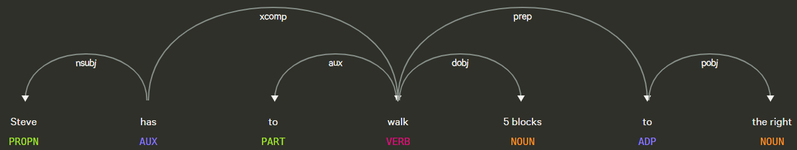

### A Way to Control Steve through Voice
Speech-To-Steve provides a way for users to control Steve via speech. Using natural language processing, we can convert audio into commands for the agent to perform in Minecraft. Microphone input is parsed into audio data that can be sent to a speech recognition API that will then convert the audio data into text. The text is further analyzed and keywords are extracted using NLP to call commands that can be called by the agent. For example, saying "kill the cow" into a microphone would lead to the agent killing a cow in Minecraft.

### NLP Dependency Visualizer

### Video Summary

### Source code: [https://github.com/geeeeeeeeew/Speech-To-Steve][quickref]

### Reports:

- [Proposal](proposal.html)
- [Status](status.html)
- [Final](final.html)

[quickref]: https://github.com/geeeeeeeeew/Speech-To-Steve
